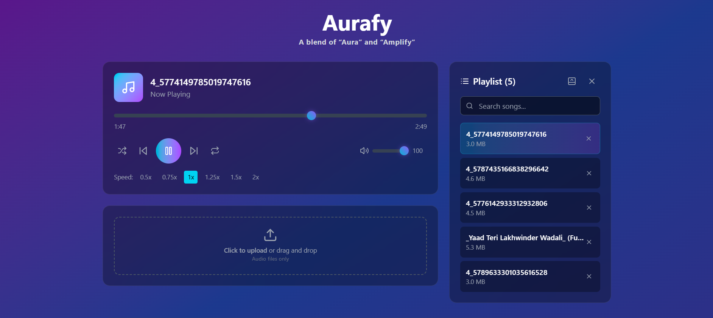

# 🎵 Aurafy

**Aurafy** is a sleek music player built with React. It allows users to upload, play, and manage their own audio files with ease. Designed with a vibrant UI, this player provides a personal and immersive listening experience.

## 🚀 Features

- 🎧 Upload and play audio files instantly
- 🧠 Smart playlist management (add/remove songs)
- 🔍 Live search through your uploaded tracks
- ⏯️ Standard controls (Play, Pause, Next, Previous)
- 🔁 Repeat and 🔀 Shuffle modes
- 📈 Adjustable playback speed (0.5x – 2x)
- 🔊 Volume control slider
- 🌗 Responsive, theme-friendly UI
- 🧹 Clean drag-and-drop interface for uploading audio files
- ⌨️ Full keyboard control

## 📦 Built With

- **React** – Frontend framework
- **CSS / Tailwind** – Custom UI styling (based on your tech stack)
- **lucide-react** – Beautiful icon support

## 🖼️ Screenshot

